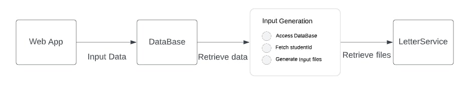

# StudentFiles, A student record management system 
**Introduction**  
- This repository is intented as a front-end design in correspondence with the LetterMerge functionality, in an effort to consider how the overall pipeline can be structured and then improved. It consists of a web application and a console application, both of which interact with a SQL Server Express LocalDB database containing student records. 
The web application provides CRUD operations and a search-by-name method for the existing student data, 
while the console application retrieves student records based on their admission status and generates dated input folders. 

**Features**  
- A database that holds student records.
- A web application that provides CRUD operations for the student records and a search-by-name method.
- A console application that interacts with the database and retrieves student records based on their admission status and generates dated input folders.

**Requirements**
- .NET 7 framework in C#
- Entity Framework Tools
- SQL Server Express LocalDB  

**Usage**
- Download the repository and extract it to your Desktop.
- To set up the database, open the solution named "StudentFiles" in Visual Studio. In the drop-down toggle, select "StudentFiles".
- In the menu, navigate to Tools -> NuGet Package Manager -> Package Manager Console.
- In the Package Manager Console, type in the command: "Add-Migration StudentFilesInitial" (without the quotes) and press enter.
- Then, type in the command: "Update-Database" (without the quotes) and press enter.
- The database should now be seeded and ready to be accessed.
- Open the SQL Server Object Explorer, check if a database with keywords "StudentFilesContext" is generated; also, run the app to see if three student records are displayed.
- Next, change the toggle to "InputFolderGeneration". In the debug properties setting, change the working directory to the main master folder. It should look like: "C:\Users\<userid>\Desktop\StudentFiles-master".
- Run the program.
- Follow the next steps to see if the run is successful.  

**Testing**  
There are two parts of the repository that need to be tested:  
- The web app: 
  - Launch the StudentFiles app to examine if the database has the three records (sometimes the SQL Server Object Explorer can show empty data if right-clicking 
on "dbo.student" to view data, either refresh or close and reopen the SQL Explorer to solve this issue).
  - Check the CRUD functions to see if they work.
- The console app (Since no arg input is provided, the code selects "02122023" (in MMddyyyy format) to be the name of the dated folders): 
  - In the StudentFiles-master folder, check to see if, under the two "Admission" and "Scholarship" subfolders, the dated folders are generated. 
  - There should be one letter in the scholarship folder (Scholarship-01230123.txt) and two in the admission folder (Admission-00000123.txt, Admission-01230123.txt).
  - Within the txt files; it should include the studentid, date of release, and a message which reads "Congratulations on your {type}! You should receive your (type) letter in the mail soon." 

**Design**  
  
- The overall structure is streamlined: once the database is set up (here the localdb is initialized, seeded, and kept up-to-date by Entityframework), the user can then create/update/delete information on the web app. After the database has received input, the information can be accessed by downstream services: the inputgeneration module interacts with the localdb to generate daily files (on workdays) , and the LetterService uses the files to perform the combine-letters service. To be more specific:
  - The database is seeded and then generated by EntityFrameWork using Code First design;
  - Some validation clauses are added when a user wants to create/modify the fields (for instance, the StudentId must be eight-digit)
  - For testing purposes, in the InputFolderGeneration project, the implied date is pre-determined; however, deleting the command-line arguments would force the console app to take the date as today.
  - In the LetterGeneration.cs file, the class includes two methods:
    - 'LocateStudents': finds studentids that has either admission or scholarship letters;
    - 'GenerateInput': generates the dated folders and the txt files of the folders.

**Assumptions and their corresponding vulnerability**
- While designing the database, assumptions are:
  - The release date of a letter can be different from the date when the data is entered. For instance, if an admission officer has reviewed the file in Februrary, there can be several reasons that could prevent them from releasing the good news to the students timely:
    - The university could have required an earlist release date (which can be some date in April);
    - Or if the admission officer on edge deciding if someone is qualified (waitlisted, for instance), by setting a later date, the officer allows themself the chance to give the case a second thought later.
    - ** However, if the letters should be released a.s.a.p, to avoid redundancy, the CRUD function should be improved so that the input can be null and the release date should be the day of the data entry.
  - All prospect students -- even without admission or scholarship -- are given their 8-digit StudentId
- While designing the console app that generates input folders and files, assumptions are:  
  - Later this code will be automatically run on all weekdays at a time before 10 a.m. This assumption can prove to be valid because: 
    - Input generation seems to be a service that is mandatory, whereas the need for combining letters can shift based on needs;
    - Automatic runs can avoid human mistakes (such as running the program twice on a weekday, forgetting to run it on a day, etc.)
    - Therefore, if this assumption holds, then many checks that are essential for the LetterMerge services (such as check if the date is a weekday or if it is run twice) can be managed by a shell script (or windows scheduler to make life simpler). 
    - ** However, if the console app needs to be run manually, then here, many functions and unit tests are lacking.
  - Input folders have two subfolers already creadted, namely, "Admission" and "Scholarship".

**Planning for the project and actual time used**
- Planning -- 1 hour planned/1 hour used
- Set up the database and Implement the web app -- 2 hours planned/4 hours used
  - The unexpected and somewhat disappointing amount of exceeded time arrived because in the original implementation, the CRUD functions were set up page-by-page. But after getting to the Delete function and realizing that using EF scaffolding could be much quicker (and less error-prone), the implementation has to start over.
- Implement the console app functions -- 2 hours planned/1.5 hours used
  - The design and realization of the console app is very similar to the LetterMerge, and it does not take long.
- Debugging, packaging -- 1 hour planned/~1 hours used
- Documentation -- 2 hours planned/~2 hours used

**Outlook and discussions**  
- The web app can use:
  - More fields, such as age, email, address, state, date created
  - A more robust toggle function, which can include
    - Filter by age
    - Filter by date created
    - Filter by accepted or not (for admission as well as scholarship)
- The console app can benefit from:
  - UnitTesting, which includes the two methods of the 'LetterGeneration' class
  - Moving the database to a cloud-based database so that the end-user do not have to establish or hold a database of their own
- And there are areas that can be further discussed:
  - One of the first priorities in designing this pipeline is to determine where the user comes in so that 1) it allows ample flexibility for the user to access, interprete, and manipulate the database and 2) avoid human mistakes as often as possible. If every student admission file is packed as a single pdf and all information can be automatically extracted, then the web app interface would not be useful.
  - In the current phase, the web app is very raw. If needed, further analytical tools should be added to utilize the data better.
  - In the current assembly, the two functionalites -- database design and the input generation -- are packed together. Perhaps the lettermerge repo should be incorporated into this solution to reuse some of the IletterServices methods, thus adhering to the DRY (Don't repeat yourself) principle.

**Conclusion**  
The StudentFiles repository provides a student record management system with a web application and a console application that interact with a SQL Server Express LocalDB database containing student records. The web application provides CRUD operations and a search-by-name method for the existing student data, while the console application retrieves student records based on their admission status and generates dated input folders. 
